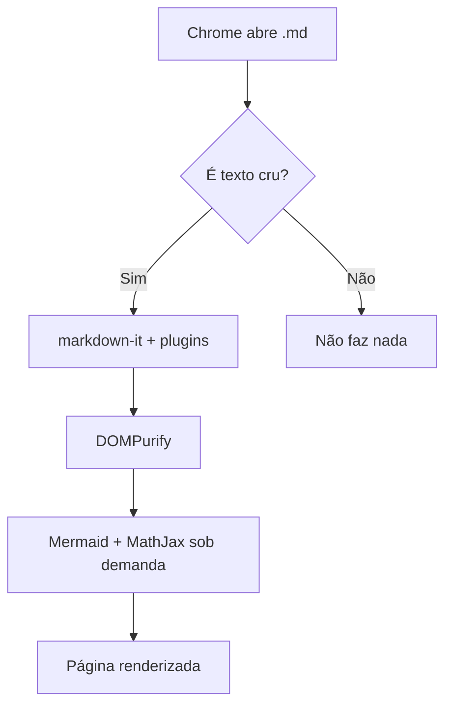
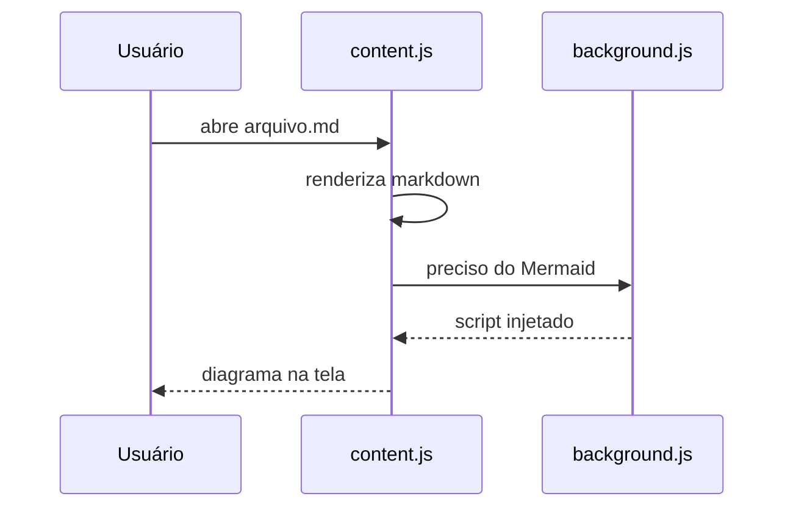

# VladeMD-View — documento de teste

Este arquivo existe para conferir a olho nu se **tudo** renderiza. Se alguma
seção abaixo aparecer como texto cru, o recurso correspondente quebrou.

## Formatação básica

Texto **negrito**, *itálico*, ***os dois***, ~~riscado~~, `código inline`,
==destaque do Obsidian== e uma tecla <kbd>Ctrl</kbd> + <kbd>C</kbd>.

Um link [normal](https://example.com), um automático https://example.com e um
wikilink [[Outra Nota]] apontando para o arquivo vizinho.

Tags soltas no meio do texto: #arquitetura #backend/api #teste

> Citação normal, que **não** deve virar callout.

---

## Emoji

Alegria :smile: :rocket: :tada: :warning: :white_check_mark: :books: :fire:

Veja a lista completa com os emojis mais usados na página [My_Emoji](My_Emoji.md).

## Científico

Água é H~2~O, a área é X^2^ e a constante é 6,022×10^23^.

Fórmula inline: a identidade $e^{i\pi} + 1 = 0$ fecha o parágrafo.

Fórmula em bloco:

$$
\int_{-\infty}^{\infty} e^{-x^2}\,dx = \sqrt{\pi}
$$

Matriz:

$$
A = \begin{pmatrix} a & b \\ c & d \end{pmatrix}
$$

Cifrão comum não pode virar fórmula: o item custa $5 e o frete $10.

## Tabelas (GFM)

| Recurso    | Origem       | Status | Observação                     |
| ---------- | ------------ | :----: | ------------------------------ |
| Tabelas    | GitHub       |   ✅   | Alinhamento por coluna         |
| Callouts   | Obsidian     |   ✅   | 13 tipos com ícone             |
| Mermaid    | Claude Code  |   ✅   | Carregado sob demanda          |
| MathJax    | LaTeX        |   ✅   | SVG, sem baixar fontes         |
| Wikilinks  | Obsidian     |   ✅   | Resolve para `.md` vizinho     |

## Listas de tarefas

- [x] Renderizar GFM
- [x] Renderizar dialeto do Obsidian
- [ ] Publicar na Chrome Web Store
  - [x] Item aninhado marcado
  - [ ] Item aninhado pendente

1. Primeiro
2. Segundo
   1. Aninhado
3. Terceiro

## Callouts do Obsidian

> [!NOTE] Uma nota
> Callouts aceitam **markdown** dentro, inclusive `código` e listas:
>
> - item um
> - item dois

> [!TIP] Dica rápida
> Use o botão de tema na barra superior.

> [!WARNING] Atenção
> O Chrome exige permissão manual para ler `file://`.

> [!DANGER] Perigo
> Nada aqui é destrutivo, é só a cor vermelha.

> [!SUCCESS] Deu certo

> [!QUESTION]- Callout recolhível (começa fechado)
> Este conteúdo só aparece ao clicar no título.

> [!EXAMPLE]+ Callout recolhível (começa aberto)
> Este já vem expandido.

> [!QUOTE] Citação
> "A melhor linha de código é a que não foi escrita."

## Código

```python
from dataclasses import dataclass

@dataclass
class Documento:
    caminho: str
    linhas: int = 0

    def resumo(self) -> str:
        return f"{self.caminho}: {self.linhas} linhas"
```

```bash
# passe o mouse no bloco para ver o botão de copiar
find . -name '*.md' -exec wc -l {} +
```

```json
{ "manifest_version": 3, "name": "VladeMD-View" }
```

## Diagramas Mermaid





## Notas de rodapé

Texto com nota[^1] e outra[^obs].

[^1]: Primeira nota de rodapé.
[^obs]: Notas aceitam `código` e **negrito**.

## HTML inline

<details>
<summary>Um details escrito em HTML puro</summary>

Conteúdo interno, com **markdown** funcionando normalmente.

</details>

## Títulos profundos (para testar o sumário)

### Nível três

Conteúdo.

#### Nível quatro

Conteúdo.

##### Nível cinco

Fim do documento. ^bloco-final

<footer class="wrap footer">
    <span>VLADETEC © 2026 - <strong>VladeMD-View</strong>. Tecnologia e Inteligência na Disposição que
        inspira.</span>
    <span>Feito para quem pensa no amanhã.</span>
</footer>
